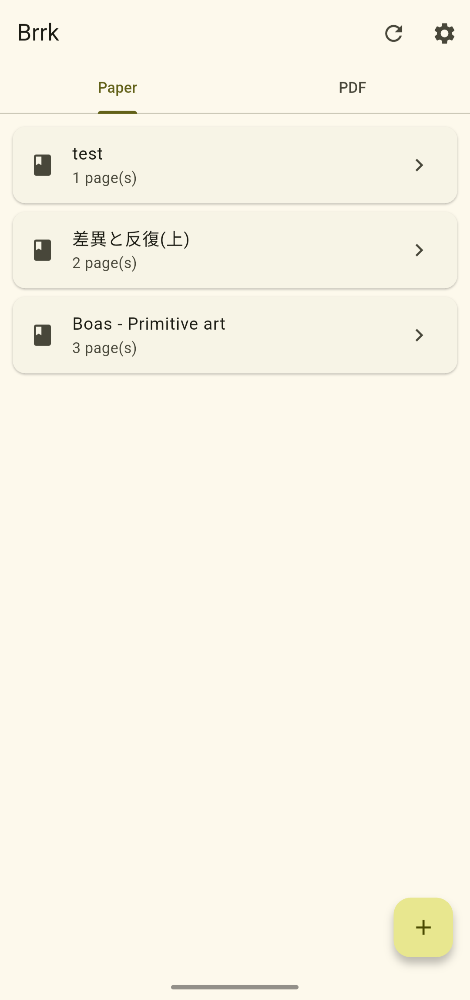
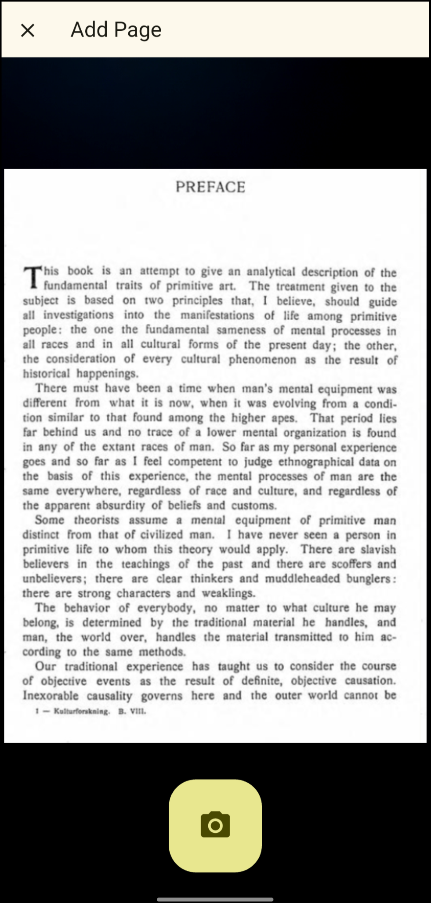
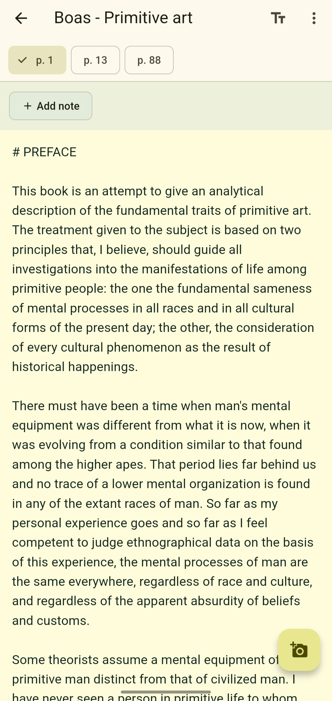
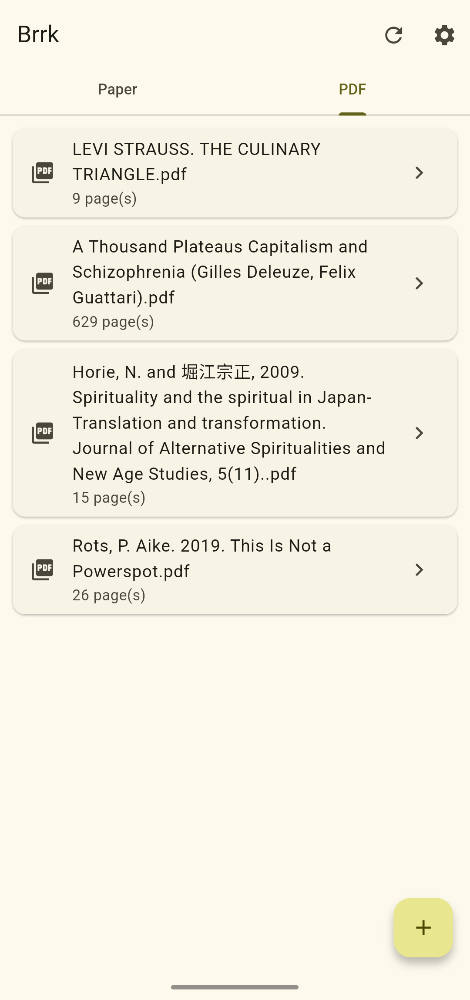
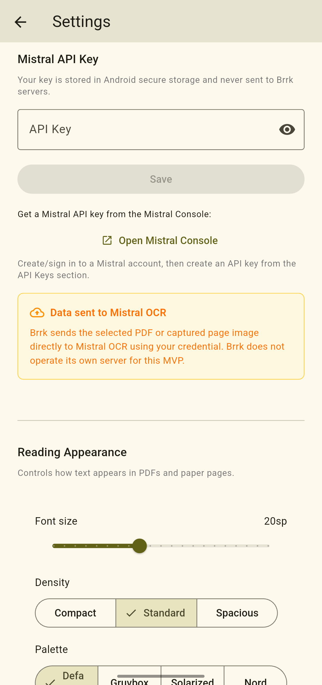

# Brrk

<p align="center">
  
</p>

<p align="center">
  <strong>Turn paper books and PDFs into readable Markdown on Android.</strong>
</p>

<p align="center">
  Android beta · Local-first · BYOK Mistral OCR
</p>

---

## Status

Brrk is currently in **open beta testing** for Android.

It is useful for early testers who want to:

- capture physical book pages with a camera,
- import PDFs,
- run OCR with their own Mistral API key,
- read the result as clean, reflowable Markdown,
- keep notes and page labels locally.

This is still beta software. Please keep backups of anything important.

---

## Screenshots

<p align="center">
  
  
  
</p>

<p align="center">
  
  
</p>

---

## Features

### Paper books

- Create a book first, then add captured pages.
- Take a photo of a page from a physical book.
- Adjust crop before OCR.
- Save OCR text as Markdown.
- Add page labels such as `p. 12`, `xv`, or custom labels.
- Add notes and tags to captured text.

### PDFs

- Import local PDF files.
- Run OCR with Mistral.
- Read extracted Markdown page by page.
- Resume from the last-read page.
- Delete imported PDFs and cached OCR data from inside the app.

### Reading appearance

- Adjust font size.
- Choose compact, standard, or spacious density.
- Switch color palettes for comfortable reading.

---

## Install the beta

1. Open the latest GitHub Release.
2. Download the Android APK.
3. Optionally verify the SHA256 checksum published with the APK.
4. Install the APK on Android.

Android may show a warning because this is installed outside the Play Store. You may need to allow installation from your browser or file manager.

### Requirements

- Android 8.0 / API 26 or newer
- Internet access for OCR
- A Mistral API key for OCR features

You can create a Mistral API key from:

<https://console.mistral.ai/>

---

## Privacy and data handling

Brrk is local-first and does **not** operate a Brrk server.

Important details:

- Your Mistral API key is stored locally on your Android device using secure storage.
- When you start OCR, the selected PDF or captured page image is sent directly to Mistral OCR using your API key.
- OCR usage may be billed to your Mistral account.
- Imported PDFs, captured page images, OCR Markdown, notes, tags, and cache data are stored in app-private local storage.
- Android full-data backup is disabled for Brrk.
- Uninstalling the app removes app-private local data from the device.

Please do not share bug reports containing API keys, private documents, OCR response bodies, or sensitive extracted text.

---

## Permissions

Brrk uses only the permissions needed for the current beta:

- **Camera** — capture physical book pages.
- **Internet** — send user-selected files/images to Mistral OCR.

PDF import uses Android's file picker.

---

## Known limitations

- Android only.
- OCR requires your own Mistral API key.
- No cloud sync.
- No user accounts.
- No analytics.
- No automatic backup.
- Large or unusual PDFs may fail OCR depending on Mistral limits and network conditions.

---

## Feedback and bug reports

Please open a GitHub Issue with:

- app version,
- Android version,
- device model,
- steps to reproduce,
- expected result,
- actual result,
- screenshots if helpful.

Do **not** include API keys, private document contents, full OCR responses, or sensitive personal information.

---

## Build from source

Brrk is built with Flutter and Rust via `flutter_rust_bridge`.

```bash
git clone https://github.com/ragman53/brrk.git
cd brrk
flutter pub get
flutter_rust_bridge_codegen generate
flutter build apk --debug
```

Useful checks:

```bash
flutter analyze
flutter test
cd rust && cargo fmt --check && cargo clippy -- -D warnings && cargo test -- --test-threads=1
```

Release signing files are intentionally not included in the repository.

---

## License

Brrk is licensed under the Apache License 2.0. See `LICENSE`.
